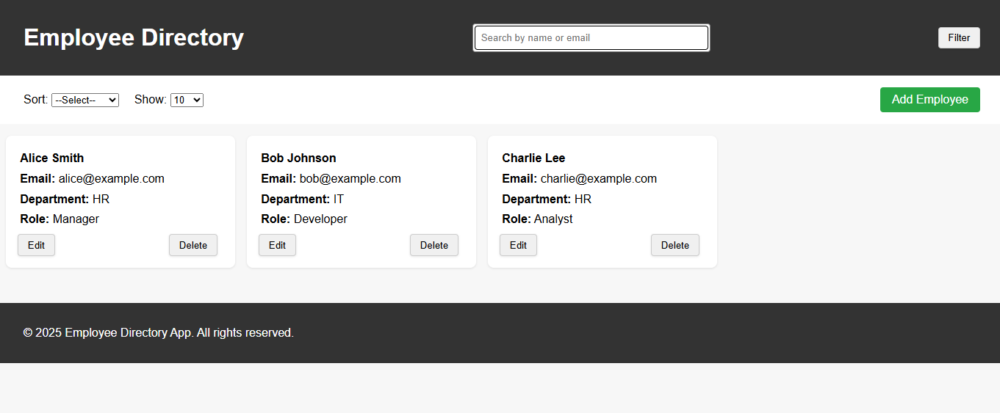
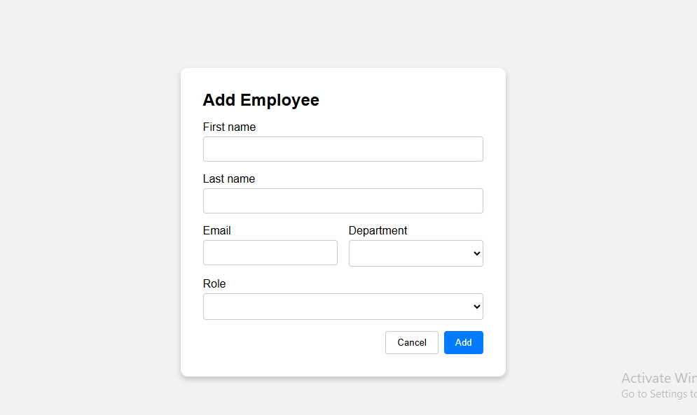
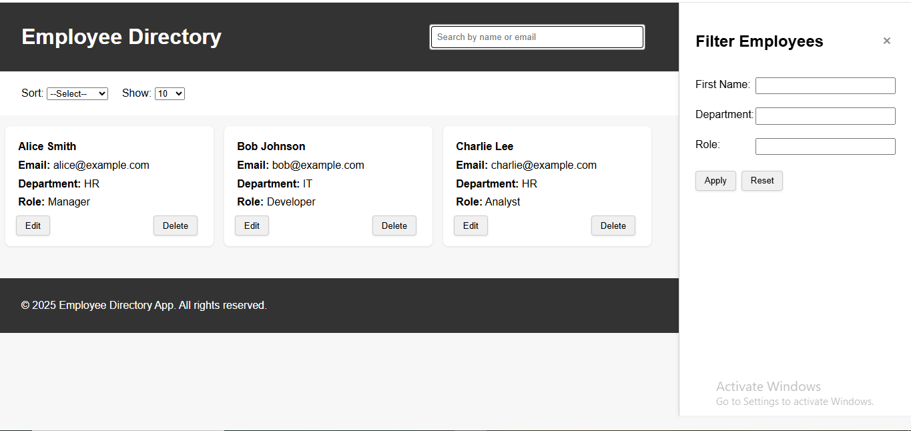

 🧑‍💼 Employee Directory Web App

A responsive web application to manage employee information—add, view, filter, sort, and delete employee records using the browser's local storage.

---

## 📁 Project Structure

employee-directory/
│
├── index.html # Main landing page with list, filters, sorting
├── form.html # Add/Edit employee form
├── styles/
│ └── main.css # All global and responsive styles
├── scripts/
│ ├── main.js # Logic for search, filter, sort, delete
│ └── form.js # Add/edit employee logic with validations
└── README.md # You're reading it now


## 🚀 Setup & Run Instructions

1. **Download or Clone the Repository**
   ```bash
   git clone https://github.com/yourusername/employee-directory.git
   cd employee-directory
Run the App

No server setup required.

Simply open index.html in any modern web browser (Chrome, Edge, Firefox).

📸 Screenshots

# Dashboard


# Form - Add employee


# Filter - Sidebar



✅ Features
Add, edit, delete employees

Filter by name, department, or role

Search by name or email

Sort and control number of items per page

Responsive layout (mobile/tablet/desktop)

Error handling and form validation

Unsaved changes alert during form editing

⚠️ Validation & Error Handling
Validates required fields and email format

Prevents adding or editing without valid data

Warns user before leaving unsaved form edits

Graceful handling when no employee is selected for edit/delete

🔄 Data Handling
Data is persisted using localStorage

Mock data initialized if storage is empty

Edits update the data in-place using query param edit=index

🤔 Reflection
👷 Challenges Faced
Creating a consistent layout across screen sizes

Managing form state between add/edit modes

Handling localStorage updates correctly

💡 Improvements for the Future
Integrate with a backend/database (e.g., Firebase or Node.js)

Add avatar/image upload per employee

Include pagination buttons for easier navigation

Use frameworks like React for component reusability

🛠️ Built With
HTML5

CSS3 (flexbox, media queries)

JavaScript (vanilla, DOM, localStorage)

